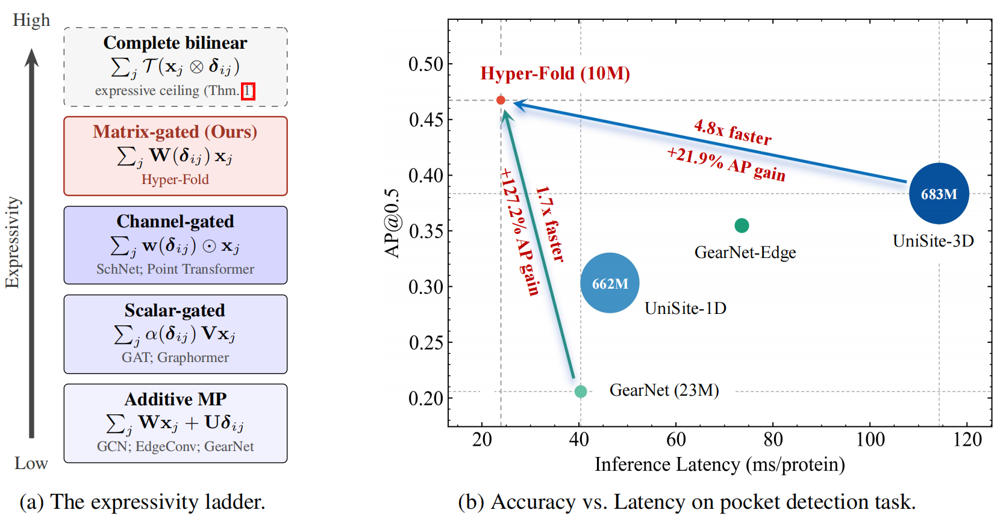
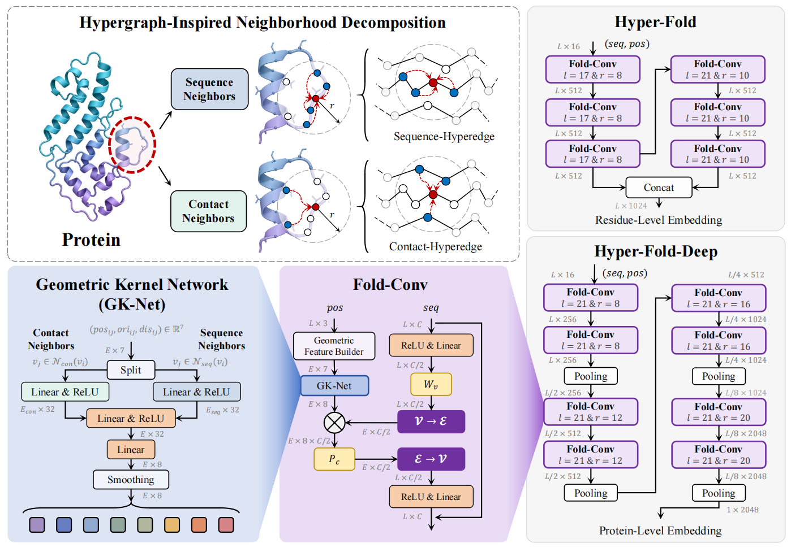
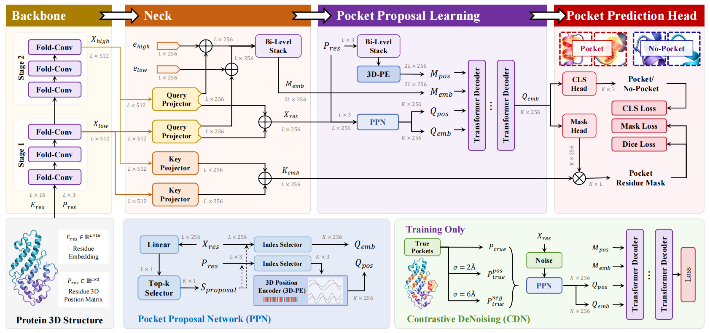
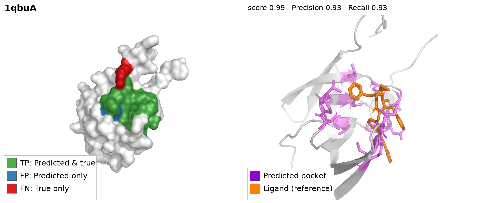

<h1 align="center">Hyper-Fold</h1>

<p align="center">
  <b>Hyper-Fold: Exploring the Expressive Limit of Sequence-Geometry Learning for Proteins via Hypergraph Modeling</b><br>
  Yifan Feng¹, Guanjie Cheng², Shihui Ying³, Shaoyi Du⁴, Yue Gao¹<br>
  ¹ Tsinghua University · ² Zhejiang University · ³ Shanghai University · ⁴ Xi'an Jiaotong University
</p>

<p align="center">
  
  
  
  
</p>

<p align="center">
  <a href="#about">About</a> &#xa0; | &#xa0;
  <a href="#quick-start">Quick Start</a> &#xa0; | &#xa0;
  <a href="#data--training">Data & Training</a> &#xa0; | &#xa0;
  <a href="#results">Results</a> &#xa0; | &#xa0;
  <a href="DATASETS.md">Datasets</a> &#xa0; | &#xa0;
  <a href="examples/README.md">Examples</a>
</p>

<div align="center">
  
</div>

*Left: the expressivity ladder of message passing — additive MP (GCN, GearNet) → scalar-gated (GAT) → channel-gated (SchNet) → our matrix-gated Fold-Conv, which provably approaches the complete bilinear ceiling. Right: pocket detection accuracy vs. latency — Hyper-Fold (10M) is 4.8× faster than UniSite-3D (683M) with +21.9% AP, and 1.7× faster than GearNet (23M) with +127.2% AP.*

## About

Protein structure modeling rests on a single computational primitive: the interaction between what a residue *is* (sequence content) and *where it sits* (3D geometry). Hyper-Fold is a new framework for protein 3D-structure learning that pushes this primitive to its expressive limit. Its core operator, the **Fold-Conv layer**, splits each residue's neighborhood into a **sequence hyperedge** and a **contact hyperedge**, and generates per-edge kernels with a **geometric kernel network (GK-Net)** — a rank-K matrix gate that strictly dominates the additive, scalar-gated and channel-gated layers used by classic methods (GCN, GAT, SchNet, GearNet). The result: stronger expressivity, higher accuracy, and lower latency at a fraction of the parameters.

All models are **purely structural** — the input is the residue type and Cα coordinates only, no sequence language model (ESM) features anywhere.

<div align="center">
  
</div>

*The Fold-Conv operator and the two backbone stacks: residue-level Hyper-Fold and protein-level Hyper-Fold-Deep.*

| Model | Task | Recipe |
|---|---|---|
| `HyperFold` | EC number | 6 Fold-Conv blocks, width 512 |
| `HyperFoldDeep` | fold classification | 4 stages, 256→2048, residue pooling |
| `HyperFoldPocket` | pocket detection | + bi-level neck, 50 PPN-anchored queries, transformer decoder, CDN |

<div align="center">
  
</div>

*Hyper-Fold-Pocket: the residue-level backbone plus a set-prediction detection head — a pocket proposal network (PPN) anchoring 50 queries, a 4-layer transformer decoder with 3D Fourier positional encoding, and contrastive denoising (CDN) training.*

## Quick start

```bash
uv venv .venv && source .venv/bin/activate
uv pip install -e .
python scripts/predict.py --pdb examples/1qbuA.pdb   # or any PDB of yours
```

<div align="center">
  
</div>

*Left: surface colored TP green / FP blue / FN red. Right: predicted pocket (violet) wraps the co-crystallized ligand (orange). More in [examples/](examples/README.md).*

## Data & training

```bash
bash scripts/download_data.sh   # UniSite-DS + HOLO4K-sc / COACH420; see DATASETS.md

torchrun --nproc_per_node=2 scripts/train_pocket.py --config configs/pocket.yaml
python scripts/train_ec.py    --config configs/ec.yaml
python scripts/train_fold.py  --config configs/fold.yaml
```

Evaluate with `scripts/eval_ap.py` (AP@IoU 0.3/0.5) and `scripts/eval_dcc_dca.py` (DCC/DCA@4 Å).

## Results

Pocket detection (all methods trained on UniSite-DS only; HOLO4K-sc / COACH420 are zero-shot; DCC/DCA are top-n success rates at 4 Å):

| Method | UniSite-DS AP@0.3 | UniSite-DS AP@0.5 | HOLO4K-sc AP@0.3 | HOLO4K-sc DCC | HOLO4K-sc DCA | COACH420 AP@0.3 | COACH420 DCC | COACH420 DCA |
|---|---|---|---|---|---|---|---|---|
| Fpocket | 0.184 | 0.102 | 0.271 | 0.308 | 0.438 | 0.211 | 0.271 | 0.411 |
| Fpocket-rescore | 0.508 | 0.235 | 0.590 | 0.518 | 0.765 | 0.560 | 0.441 | 0.711 |
| P2Rank | 0.506 | 0.216 | 0.601 | 0.530 | <u>0.819</u> | 0.619 | 0.464 | 0.741 |
| Deep-Pocket | 0.427 | 0.233 | 0.542 | 0.493 | 0.737 | 0.518 | 0.396 | 0.676 |
| GrASP | 0.447 | 0.285 | 0.667 | 0.513 | 0.742 | 0.715 | 0.485 | <u>0.762</u> |
| VN-EGNN | 0.162 | 0.071 | 0.261 | <u>0.586</u> | 0.700 | 0.264 | <u>0.545</u> | 0.753 |
| UniSite-1D | 0.512 | 0.303 | 0.687 | 0.554 | 0.769 | 0.592 | 0.455 | 0.735 |
| UniSite-3D | <u>0.560</u> | <u>0.384</u> | <u>0.709</u> | 0.572 | 0.788 | <u>0.720</u> | 0.470 | 0.738 |
| **Hyper-Fold-Pocket (ours)** | **0.617** | **0.467** | **0.735** | **0.681** | **0.827** | **0.768** | **0.563** | **0.786** |

EC (Fmax@50% / AUPR@95): **0.789 / 0.874** · Fold / superfamily / family: **0.578 / 0.794 / 0.995**

## Tests

```bash
python tests/test_foldconv.py   # shapes, SE(3) invariance, GK-Net bucketing
```

## Citation

```bibtex
@article{feng2026hyperfold,
  title  = {Hyper-Fold: Exploring the Expressive Limit of Sequence-Geometry
            Learning for Proteins via Hypergraph Modeling},
  author = {Feng, Yifan and Cheng, Guanjie and Ying, Shihui and Du, Shaoyi and Gao, Yue},
  year   = {2026},
}
```
