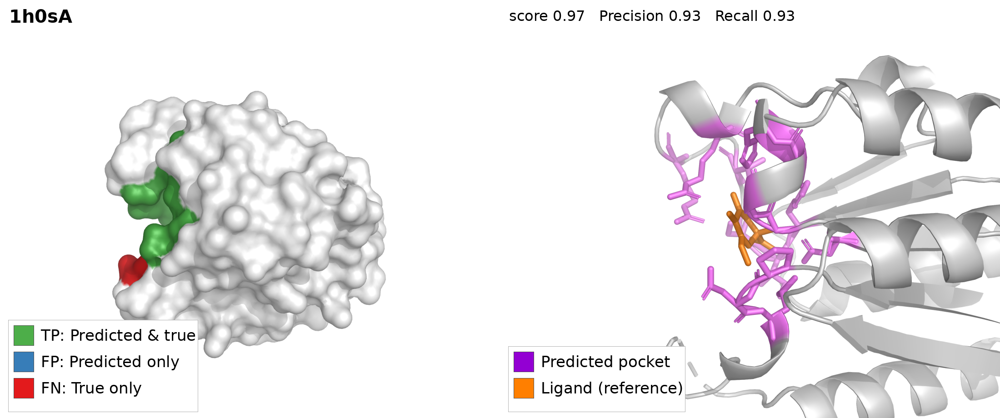
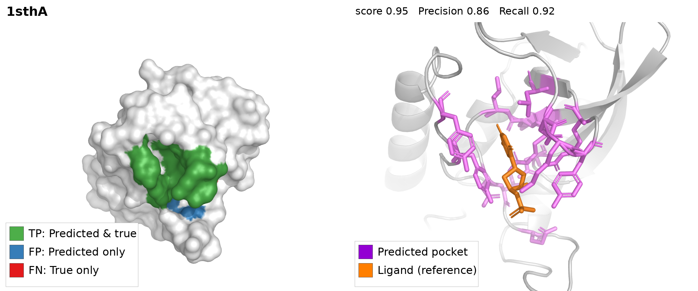

# Examples

Three sample proteins from the COACH420 benchmark with Hyper-Fold-Pocket
predictions produced by the released checkpoint
(`checkpoints/hyperfold_pocket_unisite_ds.pth`).

| File | Content |
|---|---|
| `1qbuA.pdb`, `1h0sA.pdb`, `1sthA.pdb` | input structures (protein chain) |
| `*_ligand.pdb` | co-crystallized ligands (reference only, not used by the model) |
| `*.prediction.txt` | console output of `scripts/predict.py --pdb` |
| `*.prediction.pkl` | full prediction record (scores, residue masks, pocket centers) |
| `*_panel.png` | two-view panel (see below) |
| `render_example.pml` | PyMOL script for the zoomed view |

Only the input PDBs and the panels are tracked in git; the `*.prediction.*`
files are generated outputs (git-ignored, regenerated by the command below).





Each `*_panel.png` shows two views of the same prediction:

- **Left** — whole-protein surface with pocket residues colored by
  correctness: green = TP (predicted & true), blue = FP (predicted only),
  red = FN (true only).
- **Right** — zoomed view of the pocket: predicted pocket residues as violet
  sticks, the co-crystallized ligand as orange sticks (reference only).

Reproduce the prediction from the repository root:

```bash
python scripts/predict.py --pdb examples/1qbuA.pdb --out examples/1qbuA.prediction.pkl
```

Expected output (`1qbuA.prediction.txt`):

```
1qbuA: 99 residues, 1/50 predicted pockets (score > 0.5)
  pocket 0: score=0.993 center=(-7.4, 16.7, 31.5) residues=[23, 25, 27, 28, 29, 30, 32, 47, 48, 49, 50, 80, 81, 82, 84]
```

In all three examples the predicted pocket wraps the co-crystallized ligand;
the ligand structures are included only to make this check easy to eyeball.
